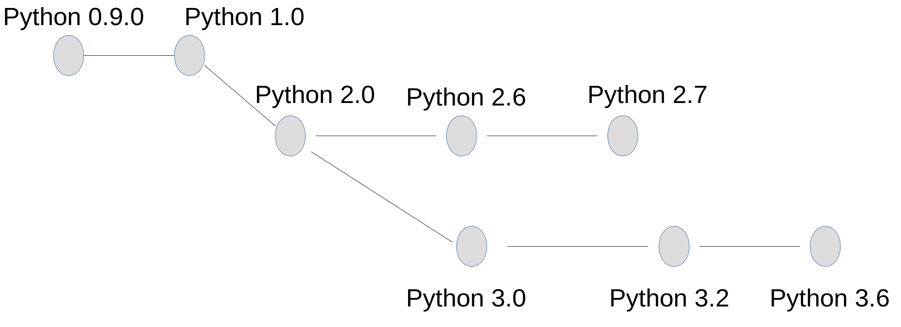

### Leverage Python 3

Note:
Agenda:
 - Brief history
 - Flaws in Python2
 - New features Python3

 ---

### Why Python 3
* Rectify design flaws
* >There should be one - and preferably only one - obvious way to do it
* Not possible to implement without breaking backwards compatibility

---
### Python Releases


Note:
Release dates:
 - 0.9 1991
 - 1.0 1994
 - 2.0 2000
 - 2.6 2008 Oct. 1st
 - 3.0 2008 Dec. 3rd
 - 2.7 2010
 - 3.2 2011
 - 3.4 2014
 - 3.6 2016

Compatibility between 2.6 and 3.0 was poor. Required a lot of backport
libraries (e.g. six - which behaves the same on both versions).

Example: unicode. Would require ```six.u("unicode")```
---
### Python 3 Readiness


Note:
- Not intended: futures
- Deprecated (new package for Py3): google_test, Beautiful soup
- Should run Py3: ansible, Fabric

---
### Python 3 Arguments

* Fixed Flaws from Python2
* Syntax enhancement
* New Features

---
### Python 2 Issues
Note:
 - subprocess is not threadsafe
 - Threading.RLock is not signal safe
---
### Compare Everything!

In Python 2 it is possible to compare across types

```python
>>> 'one' < 2
False
```

In Python 3 comparing different types raises a TypeError

```python
>>> 5 < '5'
---------------------------------------------------------------------------
TypeError                                 Traceback (most recent call last)
<ipython-input-34-191465458398> in <module>()
----> 1 5 < '5'

TypeError: '<' not supported between instances of 'int' and 'str'
```
---
### Compare Everything!

Implicit compare (`sort()`, `max()`..)

```python
>>> sib_ages=[('Eirik', 30), ('Kristian', '24'), ('Jean-Paul', 60)]
>>> sorted(sib_ages, key=lambda x:(x[1]))
[('Eirik', 30), ('Jean-Paul', 60), ('Kristian', '24')]
```
---
### Try-catch

Python 2:
```python
>>> try:
>>>     a = 5/'hello'
>>> except TypeError, err:
>>>     print(err, "my error")
>>>     print(type(err))
TypeError("unsupported operand type(s) for /: 'int' and 'str'",) my error
<type 'exceptions.TypeError'>
```

Python 3:
```python
>>> try:
>>>     a = 5/'hello'
>>> except TypeError as err:
>>>     print(err, "my error")
>>>     print(type(err))
unsupported operand type(s) for /: 'int' and 'str' my error
<class 'TypeError'>
```
---
### Try-catch

What if you don't forward the error?
Python 2:

```python
>>> i='hello'
>>> try:
>>>     a = 5/i
>>> except TypeError:
>>>     raise NotImplementedError('A completely horrible msg')
Traceback (most recent call last):
 File "<stdin>", line 4, in <module>
NotImplementedError: A completely horrible msg
```

---
### Try-catch

Python 3 chaining exceptions
```python
>>> i='hello'
>>> try:
>>>     a = 5/i
>>> except TypeError:
>>>     raise NotImplementedError('A completely horrible msg')
Traceback (most recent call last):
  File "<stdin>", line 2, in <module>
TypeError: unsupported operand type(s) for /: 'int' and 'str'

During handling of the above exception, another exception occurred:

Traceback (most recent call last):
  File "<stdin>", line 4, in <module>
NotImplementedError: A completely horrible msg
```


---
### String Handling - Python 2

* In Python 2 the `str` type only handles ASCII
* The `unicode` was introduced in Python 2 to handle symbols other than ASCII
* Bytearray exist in Python 2, but no byte type
* The `encode` and `decode` allows to change type, but also requires an encoding - there are roughly 100 different encodings in Python 2

Note:
 - ASCII (American Standard Code for Information Interchange) standardized in 1968
 - Defined bytes 0 to 127; 128 to 255 was used individually to defined accented
   characters. Different schemes existed in different places in the world.
 - What happends if you have the wrong scheme - or if you would like to use two
   different schemes in the same document -> hence the birth of unicode.
---
### String Handling - Python 3
* Python 3 string type is instead <class 'str'>, which by default is unicode.
```python
>>> print('strings are now utf-8 \u03BCnico\u0394é!')
strings are now utf-8 μnicoΔé!
```
* Python 3 has both byte and bytearray
```python
>>> print('Both byte',type(b'bytes..'),' and bytearray',
>>> type(bytearray(b'bytearrays')))
Both byte <class 'bytes'>  and bytearray <class 'bytearray'>
```

---
### Other changes

* Integer division
* Leaking from list comprehension
* Input as raw_input
* Extend object when defining Class
Note:
- Input as raw_input

- Extend Object


---
### Python 3 New Features

* A total of 21 new modules

---
### Generators

Python 2
```python
>>> print range(3)
[0, 1, 2]
>>> print type(range(3)
<type 'list'>
```

* Various function `xrange`, `itertools.izip`, `dict.itervalues` to get a generator in python 2
* `range` in python 3 was implemented like `xrange`

Python 3
```python
>>> print(range(3))
range(0,3)
>>> print(type(range(3))
<class 'range'>
```
---
### Generators

* `yield from` simplifies syntax
```python
def generator(n):
    for i in range(n)
        yield i
```

```python
def generator(n):
    yield from range(n)
```

---
### Keyword only arguments

You might start out small
```python
>>> def f(name, age):
        pass
```
And then you add some default..
```python
>>> def f(name, age=30):
        pass
```
Before you need another variable..
```python
>>> def f(firstname, lastname, age=30):
        pass
```
And you'll break the API..

---
### Keyword only arguments

```python
def whatever(a, b):
    return a + b
```
Different ways of passing arguments
```python
# arguments by position
whatever(1,2)

# arguments by position from an iterable
things = [1, 2]
whatever(*things)

# arguments by keyword
whatever(a=1, b=2)

# arguments by keyword from dict
things = {'a':1, 'b':2}
whatever(**things)
```

---
### Keyword only arguments

You can have very flexible signature:
```python
def f(firstname, lastname, *args, **kwargs):
    print (firstname, lastname)
    if 'position' in kwargs:
        print(kwargs['position'])
    if 'age' not in kwargs:
        age=20
f('lars','hauge',**{'position':'hero'})
lars hauge
hero
```

But if you like to document your arguments it will break..
```python
def f(firstname, lastname, *args, age=20, **kwargs):
SyntaxError: invalid syntax
```

---
### Keyword only arguments
Refactoring can be painful and unintentional arguments may occur

```python
>>> def f(name, age, human=False):
...     if human:
...         print('congrats ' + name + ', you are human!')
>>> f('Julius the Chimp', 20, 5)
congrats Julius the Chimp, you are human!
```

Adding more variables breaks any calls that passed the `human` argument without key

```python
>>> def f(name, age, adress, human=False):
...     if human:
...         print('congrats ' + name + ' you are human!')
...     else:
...         print(name + ' chimpy chimp')
>>> f('jpb the almighty', 20, True)
jpb the almighty chimpy chimp
```
---
### Keyword only arguments

Instead include the * to specify that all arguments can ONLY be passed by
keywords

```python
>>> def f(name, *, age, human=False):
...     if human:
...         print('congrats ' + name + ' you are human!')
>>> f('Julius the Chimp', 20, 5)

Traceback (most recent call last):
File "<stdin>", line 1, in <module>
TypeError: f() takes 1 positional arguments but 3 were given
```

---
### Keyword only arguments
Now we can add more arguments without breaking the API

```python
>>> def f(name, *, adress, age, human=False):
        pass
```
And re-arrange arguments if that would be more natural

```python
>>> def f(name, *, human=False, adress=None, age=20):
        pass
```
---
### Unpacking
```python
>>> a, *rest, b = range(5)
>>> rest
[1, 2, 3]
```
The `*rest` can be placed anywhere
```python
>>> *rest, a = range(5)
>>> rest
[0, 1, 2, 3]
```

---
### Matrix Manipulation

```python
a@b

```

---
### Print

* A statement in Python 2, a function call in Python 3

```python
>>> x = 1; y = 2; print(f"{x} + {y} = {x + y}")
1 + 2 = 3
```

---
### Asyncio

```python
>>> async def help_me(name, x):
...     print ("Helping " + name)
...     await asyncio.sleep(x)
...     if x < 10:
...         print("Finished helping " + name + ", that was easy!")
...     else:
...         print("Finished with " + name + ", he's a bit slower")
...
>>> loop = asyncio.get_event_loop()
>>> tasks = [asyncio.ensure_future(help_me("Lars Petter", 15)),
...         asyncio.ensure_future(help_me("Sveinung", 5))]
>>> loop.run_until_complete(asyncio.gather(*tasks))

Helping Lars Petter
Helping Sveinung
Finished helping Sveinung, that was easy!
Finished with Lars Petter, he's a bit slower
```
---
### Annotations

* Python doesn't do anything with annotations other than including them in an
* __annotations__ dict.
* It is however possible to use linters to verify annotations.
```python
>>> def f(a:int = 2) -> float:
...    pass
...
>>> f.__annotations__
{'a': <class 'int'>, 'return': <class 'float'>}
```
---
### Pathlib


---
### References
 - Victor Stinner - Python 3: ten years later - PyCon 2018
 - Sebastian Raschka - The key differences between Python 2.7.x and Python 3.
 - Asmeurer - 10 awesome features of Python that you can't use because you
   refuse to upgrade to Python 3
---
### List comprehension

* In Python 2 the iterator leaks
```python
>>> i = 0
>>> my_list = [i for i in xrange(5)]
>>> print (i)
4
```
---
### Input as raw_input
---
### Extend Object


